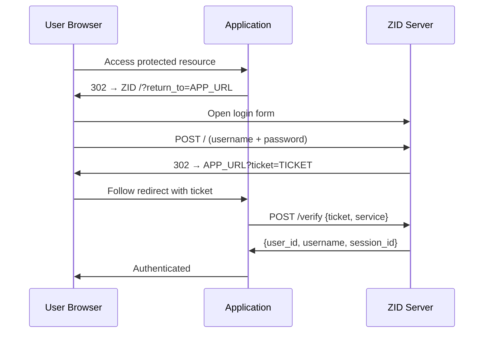
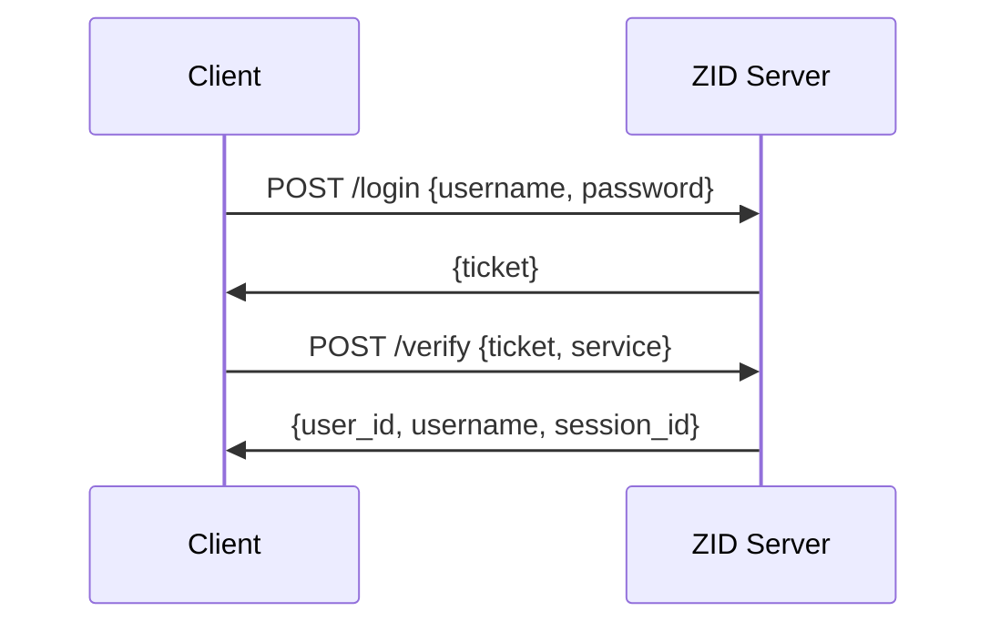
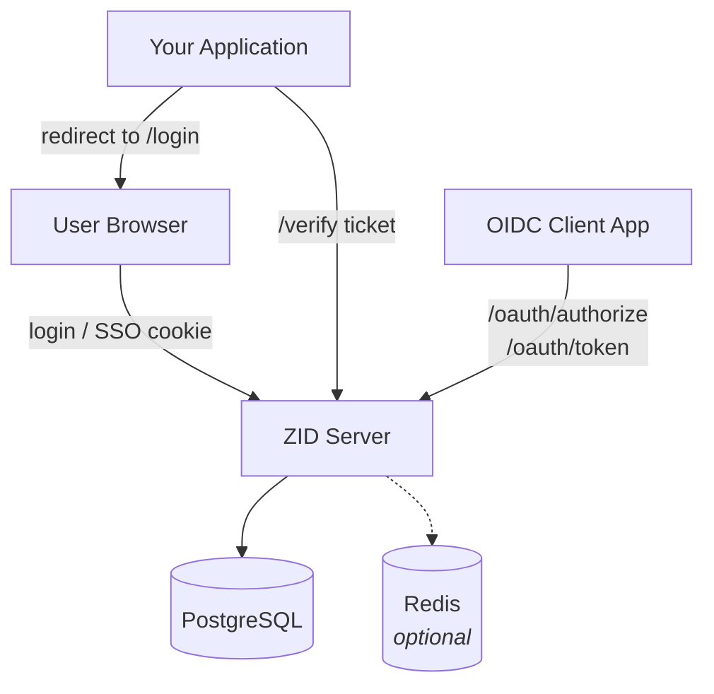
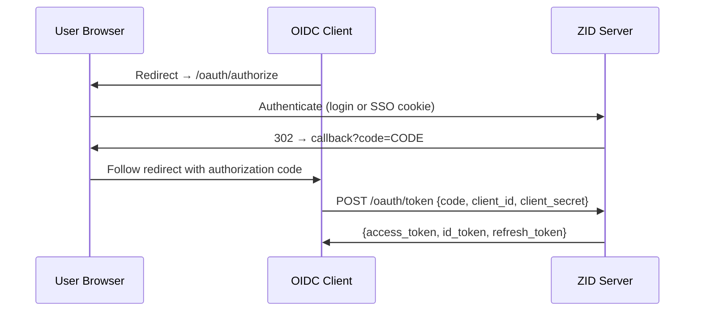

# ZID

ZID is a lightweight, self-hosted identity provider (IdP) built for homelabs, small services, and internal tools.

It implements a CAS-style authentication flow: users log in to ZID, receive a one-time ticket, and your application verifies that ticket via a simple `/verify` call to obtain the user's identity. No complex token management on your side — just redirect, verify, done.

ZID also supports optional OpenID Connect / OAuth 2.0 for applications that need standard OIDC integration.

## Features

- Single binary deployment
- CAS-style one-time ticket authentication
- Optional OpenID Connect / OAuth 2.0 (Authorization Code + PKCE, Client Credentials)
- Browser login flow with SSO cookies (login once, access multiple services)
- JSON API for programmatic authentication
- Telegram login support
- PostgreSQL, SQLite, and Redis storage backends
- Docker deployment

## Why ZID?

ZID focuses on simplicity:

- minimal setup
- predictable authentication flow
- small deployment footprint
- easy integration with small services

Most identity providers (Keycloak, Authentik, Authelia) are powerful but come with significant operational complexity — large deployments, steep learning curves, and resource overhead.

ZID takes a different approach: minimal setup, simple integration, and just enough features for smaller deployments. If you run a homelab, a handful of internal services, or a small project that needs shared authentication — ZID gets out of your way.

---

## How ZID Works

### Browser flow (most common)



1. Redirect the user to:
   - `GET http://zid-host:5555/?return_to=https://yourapp.com/callback`
2. User logs in.
3. ZID redirects to:
   - `https://yourapp.com/callback?ticket=<TICKET>`
4. Your backend calls:
   - `POST http://zid-host:5555/verify` with `{ "ticket": "...", "service": "https://yourapp.com/callback" }`
5. You receive `{ user_id, username, session_id }` and create your own session/cookie.

### JSON API flow (no UI/redirect needed)



1. Client calls `POST /login` (JSON) **without** `return_to`.
2. ZID returns `{ "ticket": "..." }`.
3. You call `/verify` and get the user identity.

---

## Architecture



---

## Quick Start

### Docker

```bash
docker compose up -d
# ZID will be available at http://localhost:5555
```

### Binary

```bash
# Download the latest release for your platform
chmod +x zid
./zid
```

> Requires PostgreSQL. See [Configuration](#configuration) for environment variables.

Health check:
```bash
curl -s http://localhost:5555/health
```

---

## SQLite Support

ZID supports SQLite as a storage backend — ideal for development, homelabs, and single-node deployments where PostgreSQL is overkill.

To run ZID with SQLite (no external database required):

```bash
export SESSION_STORAGE=sqlite
export TICKET_STORAGE=sqlite
export CREDENTIALS_STORAGE=sqlite
export SQLITE_PATH=zid.db
./zid
```

ZID creates the database file and all tables automatically on first start.

SQLite uses WAL mode and foreign keys by default. For production deployments with higher concurrency, PostgreSQL is recommended.

---

## Cookies / SSO

ZID uses an SSO cookie (`zid_sso`) to recognize returning users and offer **Continue** without re-entering credentials.

### Secure cookie and local development

Modern browsers **reject cookies with the `Secure` attribute over plain HTTP**. Therefore:
- in production ZID should run behind HTTPS (cookie must be `Secure`)
- locally (`http://localhost:5555`) you need to disable `Secure`, otherwise SSO won't persist

Controlled via `ZID_COOKIE_SECURE`:

- `auto` (default): ZID detects HTTPS from headers (`X-Forwarded-Proto=https` / `Forwarded: proto=https`)
- `true` / `1`: always set `Secure`
- `false` / `0`: never set `Secure` (useful for local HTTP development)

Recommendations:
- **prod**: `ZID_COOKIE_SECURE=auto` (or `true`) + HTTPS + proxy must forward `X-Forwarded-Proto=https`
- **local http**: `ZID_COOKIE_SECURE=false`

---

## Public Endpoints

| Method | Endpoint | Consumer | Description |
|-------:|----------|----------|-------------|
| GET    | `/` | Browser | HTML login form (supports `return_to`) |
| POST   | `/` | Browser | Login form submit (`application/x-www-form-urlencoded`) |
| POST   | `/continue` | Browser | Continue as current user (SSO) |
| GET    | `/register` | Browser | HTML registration form |
| POST   | `/register` | Browser | Registration submit (`application/x-www-form-urlencoded`) |
| POST   | `/login` | API | JSON login → ticket (+optional redirect_url) |
| POST   | `/login/telegram` | API | Telegram login JSON → ticket (+optional redirect_url) |
| POST   | `/verify` | Backend | One-time ticket verification → user info |
| POST   | `/logout` | Backend/API | Session deletion (by `session_id`) |
| GET    | `/health` | Ops | Health check |

### OIDC/OAuth 2.0 endpoints (when `OIDC_ENABLED=true`)

| Method | Endpoint | Description |
|-------:|----------|-------------|
| GET   | `/.well-known/openid-configuration` | Discovery (server metadata) |
| GET   | `/oauth/authorize` | Authorization endpoint (code flow) |
| POST  | `/oauth/token` | Token endpoint (exchange code for tokens, client_credentials) |
| GET   | `/oauth/userinfo` | UserInfo (Bearer access_token via `Authorization` header) |
| GET   | `/oauth/jwks` | JWKS (public keys for JWT verification) |

---

## Browser Login with Redirect (return_to)

### 1) Send the user to ZID

Open in browser:

`http://localhost:5555/?return_to=https://yourapp.com/callback`

> `return_to` — your application's URL (where ZID will redirect the user back).
> It must pass trusted domain validation (see `TRUSTED_DOMAINS` below).

### 2) User logs in

The form submits to `POST /` (handled by the browser).

### 3) ZID redirects back

ZID redirects the user to:

`https://yourapp.com/callback?ticket=<uuid>`

The ticket is one-time and short-lived.

### 4) Your application verifies the ticket

Request:
```bash
curl -X POST http://localhost:5555/verify \
  -H "Content-Type: application/json" \
  -d '{
    "ticket":"<TICKET_FROM_QUERY>",
    "service":"https://yourapp.com/callback"
  }'
```

Response (example):
```json
{
  "success": true,
  "user_id": "176f8257-4bec-4350-99bf-e023186fd04a",
  "username": "alice",
  "session_id": "b2a2d2d6-8c8f-4f65-bfb0-3d2bb4c1c6d9"
}
```

Next steps:
- Create your own session (cookie/JWT) and
- Redirect the user to the protected area of your application.

---

## Browser Login without return_to (no redirect)

If `return_to` is **not set**, there will be **no redirect**.

### Example:

Open: `http://localhost:5555/`

After login, ZID returns an HTML success page displaying the ticket.

Useful for manual debugging and simple integrations.

---

## JSON API Login (no UI)

### Login without return_to (no redirect)

Request:
```bash
curl -X POST http://localhost:5555/login \
  -H "Content-Type: application/json" \
  -d '{
    "username":"alice",
    "password":"secret123"
  }'
```

Response:
```json
{
  "ticket": "4b53f154-3747-463c-9a57-6e856edf4f3a"
}
```

Then verify the ticket via `/verify` as described above.

### Login with return_to (get a ready-made redirect_url)

Request:
```bash
curl -X POST http://localhost:5555/login \
  -H "Content-Type: application/json" \
  -d '{
    "username":"alice",
    "password":"secret123",
    "return_to":"https://yourapp.com/callback"
  }'
```

Response:
```json
{
  "ticket": "7ee2015f-6112-4db7-adac-d46d03ece91f",
  "redirect_url": "https://yourapp.com/callback?ticket=7ee2015f-6112-4db7-adac-d46d03ece91f"
}
```

> `redirect_url` is optional and only returned when `return_to` is provided and non-empty.

---

## User Registration

### Via browser
Open: `http://localhost:5555/register`

### Via curl (form)
```bash
curl -X POST http://localhost:5555/register \
  -H "Content-Type: application/x-www-form-urlencoded" \
  -d 'username=alice&password=secret123&password_confirm=secret123'
```

---

## Telegram Login

Supports login via Telegram Widget (on the login page) and the `/login/telegram` endpoint.

Required env vars:
```bash
TELEGRAM_BOT_TOKEN=your_bot_token
TELEGRAM_BOT_USERNAME=your_bot_username
TELEGRAM_AUTO_REGISTER=true
```

Details and examples: `docs/TELEGRAM_LOGIN.md`

---

## OIDC / OAuth 2.0 (optional)

ZID supports OIDC/OAuth 2.0 (Authorization Code + PKCE, Client Credentials).

OIDC is **enabled by default**. If the clients file or JWT keys are not configured, the server starts without OIDC (endpoints return 503). To disable explicitly: `OIDC_ENABLED=false`.

### OIDC Quick Start

1. Generate RSA keys:
   ```bash
   openssl genrsa -out oidc_jwt_private.pem 2048
   openssl rsa -in oidc_jwt_private.pem -pubout -out oidc_jwt_public.pem
   ```

2. Copy the clients file:
   ```bash
   cp oidc_clients.example.yaml oidc_clients.yaml
   ```

3. Set environment variables:
   ```bash
   OIDC_ENABLED=true
   OIDC_ISSUER=http://localhost:5555
   OIDC_CLIENTS_FILE=oidc_clients.yaml
   OIDC_JWT_PRIVATE_KEY=oidc_jwt_private.pem
   OIDC_JWT_PUBLIC_KEY=oidc_jwt_public.pem
   ```



Details and curl examples: `docs/OIDC_TESTING.md`

---

## Important Notes

### Tickets
- **One-time**: a second `/verify` for the same ticket will be rejected.
- **TTL ~ 5 minutes** (tickets expire quickly).
- Tickets are bound to a `service` URL: you must pass the same service to `/verify` that was used when the ticket was issued.

### return_to / trusted domains
ZID validates `return_to` against a list of trusted domains.

Configured via `TRUSTED_DOMAINS`:
```bash
TRUSTED_DOMAINS=localhost,127.0.0.1,*.local.dev,*.myapp.com,myapp.example.com
```

In production, make sure to add your application domains.

---

## Common Errors

### Wrong password
- `POST /login` returns an error (HTTP status depends on the handler; HTML returns a 401 Unauthorized page).

### Invalid return_to
If `return_to` fails validation, login will be rejected. Check `TRUSTED_DOMAINS`.

### Ticket already used / expired
`/verify` will not return user info.

---

## Configuration

### Environment Variables

```bash
# PostgreSQL
POSTGRES_HOST=localhost
POSTGRES_PORT=5432
POSTGRES_DB=zid
POSTGRES_USER=postgres
POSTGRES_PASSWORD=postgres

# Redis
REDIS_URL=redis://127.0.0.1:6380

# Server
SERVER_HOST=0.0.0.0
SERVER_PORT=5555

# return_to allowlist
TRUSTED_DOMAINS=localhost,127.0.0.1,*.local.dev,*.local,*.lan

# Telegram (optional)
TELEGRAM_BOT_TOKEN=
TELEGRAM_BOT_USERNAME=
TELEGRAM_AUTO_REGISTER=true

# Cookie / SSO
ZID_COOKIE_SECURE=auto        # auto (default) / true / false

# Storage backend (optional)
SESSION_STORAGE=postgres      # postgres (default), redis, or sqlite
TICKET_STORAGE=postgres       # postgres (default), redis, or sqlite
CREDENTIALS_STORAGE=postgres  # postgres (default), redis, or sqlite

# SQLite (when using sqlite storage)
SQLITE_PATH=zid.db            # path to SQLite database file

# OIDC/OAuth 2.0 (optional; enabled by default, starts without OIDC if config/keys are missing)
# OIDC_ENABLED=true
# OIDC_ISSUER=http://localhost:5555
# OIDC_CLIENTS_FILE=oidc_clients.yaml
# OIDC_JWT_PRIVATE_KEY=oidc_jwt_private.pem
# OIDC_JWT_PUBLIC_KEY=oidc_jwt_public.pem
```

### Storage
- `SESSION_STORAGE` / `TICKET_STORAGE` / `CREDENTIALS_STORAGE`
  - `postgres` (default): PostgreSQL storage
  - `redis`: Redis with built-in TTL support
  - `sqlite`: SQLite file-based storage (great for simple deployments)

---

## Docker

```bash
# start
docker compose up -d

# logs
docker compose logs -f zid-app

# stop
docker compose down
```

Default services:
- App: `http://localhost:5555`
- PostgreSQL: `localhost:5432`
- Redis: `localhost:6380`

---

## Testing

E2E test (register → login → verify):
```bash
./scripts/test.sh
```

E2E test OIDC (discovery, client_credentials, jwks):
```bash
./scripts/test-oidc.sh
```

---

## Documentation

- `docs/TELEGRAM_LOGIN.md` — Telegram Login integration
- `docs/OIDC_TESTING.md` — OIDC/OAuth 2.0 testing guide
- `docs/FREEBSD_SETUP.md` — FreeBSD installation and setup

---

## License

MIT
